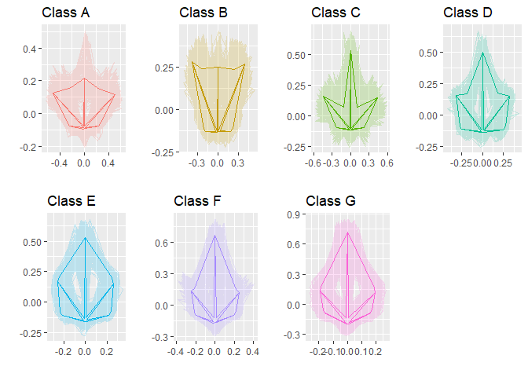
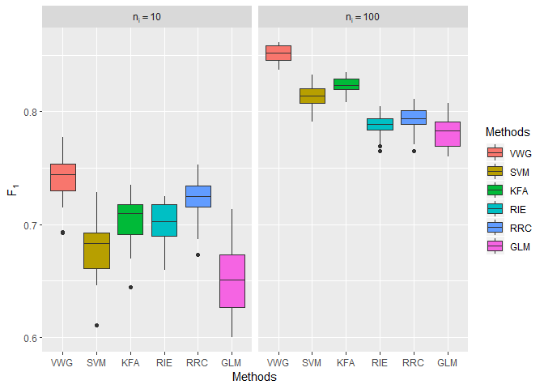
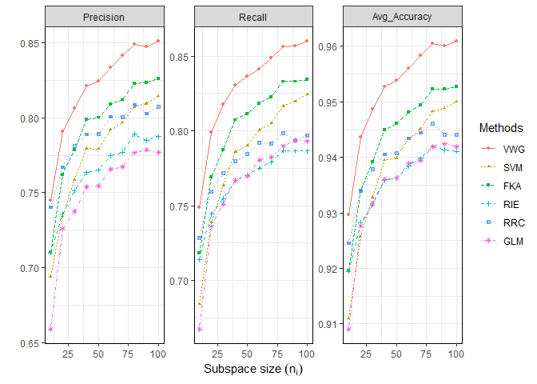

KRRC on the Planar Shape Space
================

Introduction
------------

This funtion implements the methodology described in the paper

-   Lee, H. and Patrangenaru, V. (2020). *Extrinsic Kernel Ridge Regression Classifier for Planar Kendall Shape Space* [*\[Arxiv\]*](https://arxiv.org/abs/1912.08202) [*\[Project Page\]*](https://hwiyoungstat.github.io/ShapeKRRC.html)

Installation
------------

THis package can be installed with the 'devtools' package:

``` r
library(devtools)
install_github("hwiyoungstat/ShapeKRRC")
```

Usage
-----

**`KRRC_VWG`** is the primary function that implements the kernel ridge regression classifier equipped with the veronese whitney gaussian kernel :

``` r
VWG <- KRRC_VWG(Sub_sample, Test, Test_Label,Sig,Lambda)
```

-   Inputs
    -   `Sub_sample` : Data for building subspaces
    -   `Test` : Test data (Embedded shpae : array)
    -   `Test_Label` : Test label (vector)
    -   `Sig` : Tuning parameter for kernel
    -   `Lambda` : Tuning parameter for Ridge Reg term

Simulation
----------

### Data

The `PassifloraLeaves` data used in this simulation is collected by the following papers

1.  Chitwood, D. H. and Otoni, W. C. (2016). Morphometric analysis of passiflora leaves: therelationship between landmarks of the vasculature and elliptical fourier descriptors of theblade.GigaScience, 6:1-13.

2.  Chitwood, D. H. and Otoni, W. C. (2017). Divergent leaf shapes among passiflora speciesarise from a shared juvenile morphology.Plant Direct, 1:1-15.

The data is available from their [github](https://github.com/DanChitwood/PassifloraLeaves)

The below is the graphical illustration of the dataset. The transparent and bold solid lines depicts the connected landmarks and extrinsic means, respectively.

``` r
main <- grid.arrange(grobs=myplots, ncol=4)
```



### Competing methods

1.  `VWG` : KRRC with Veronese-Whitney Gaussian kernel
2.  `SVM` : Kernelized Support Vector Machine with Gaussian kernel implemented in the `e1071` package
3.  `KFA` : Kernel Fisher Discriminant Analysis implemented in the `kfda` package
4.  `RIE` : KRRC with Riemannian Gaussian kernel
5.  `RRC` : The usual Ridge Reg Classifier
6.  `GLM` : Multiclass Generalized Linear Model with ridge penalty implemented in the `glmnet` package

### Results

-   The bolow plot illustrates the result of the simulation in terms of *F*<sub>1</sub> measure.

``` r
ggplot(All_result1 , aes(x=Methods, y=F_1, fill=Methods))+ facet_grid(. ~ size, labeller = label_parsed) + 
geom_boxplot(lwd=0.2,position=position_dodge(1)) +ylab(expression(F[1]))
```



-   Results in terms of Precision, Recall, Average accuracy are given below.

``` r
ggplot(All_result1 , aes(x=N_sub, y=Value, color=Methods))+ 
#  facet_grid(. ~ size, labeller = label_parsed, sacles="free") + 
    geom_line(aes(linetype=Methods))+
    geom_point(aes(shape=Methods),size=1)+
    facet_wrap(~ facet, scales ="free",labeller = label_parsed)+
    ylab("")+
    xlab(expression(paste("Subspace size"~(n[i]))))+
    theme(
          legend.title = element_text(size = 20),
          legend.text = element_text(size = 20),
          legend.key.size = unit(5, "lines")
    )+
    theme_bw()+
    theme(panel.border = element_rect(size=0.01, colour = "black"),
          strip.background = element_rect(size=0.01))
```


